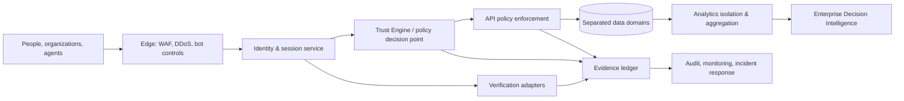

# Architecture Overview

Control planes are separated from data planes. PII/token vault, evidence ledger, product events, security telemetry, and enterprise aggregates use separate logical stores, access roles, encryption contexts, retention schedules, and export paths. A policy decision point evaluates identity, device/session, tenant, purpose, jurisdiction, consent, classification, and risk at request time.
